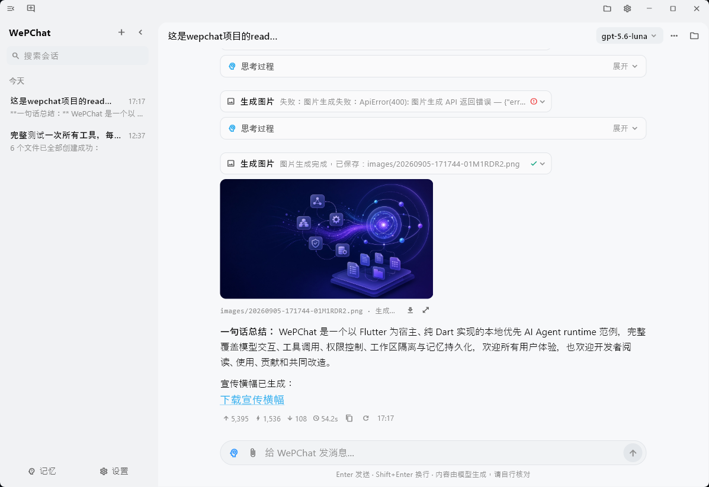
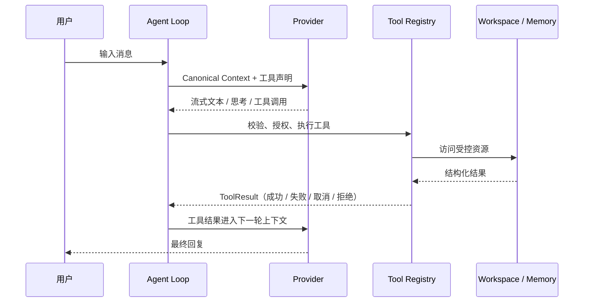

<p align="center">
  
</p>

<h1 align="center">WePChat</h1>

<p align="center"><strong>一个可以读懂、运行和改造的纯 Dart AI Agent 范例</strong></p>
<p align="center">Flutter 是宿主；Agent runtime 才是这个仓库的主角。</p>

WePChat 是一款本地优先的 AI 聊天应用
同时，它也是一份稳健的纯 Dart 实现的 Agent runtime 参考实现。

它把一次 Agent 运行中最容易被忽略的部分放在同一个仓库里：模型协议适配、流式事件、上下文整理、工具调用、权限裁决、工作区隔离、记忆持久化、取消与失败恢复。关键路径由 Dart 代码和明确的数据类型组成，不依赖 Python sidecar、Node.js agent 进程或不可见的云端编排服务。

如果你想知道一个 Agent 如何从“发起模型请求”走到“执行工具”，再把结果带回下一轮上下文；或者想把 Agent 能力嵌入 Flutter、桌面端或其他 Dart 宿主，WePChat 可以作为一个小而完整的起点。

## 截图


## 它解决什么问题

Agent 的难点从来不只是发出一次 HTTP 请求，而是让循环在真实世界的失败中仍然可预测：

- 流式输出可以增量呈现，也能可靠地收尾。
- 每个工具调用都有对应结果；失败、拒绝和取消不会把上下文弄坏。
- 模型只能操作当前会话工作区，路径越界在基础设施层被拦截。
- 工具执行经过统一的 Schema 校验、权限门和取消检查。
- 网络重试、超时、迭代上限和输出预算都是明确的控制流。
- 会话、工具结果和记忆可以落到本地，进程中断后仍能恢复可理解的状态。

这些边界不是散落在 UI 回调里的补丁，而是 runtime 的组成部分。Flutter UI 只是当前的一份宿主实现；替换 UI 时，Agent Loop 和工具管线仍可沿用。

## 一次 Agent 运行



对应的核心代码可以按这个顺序阅读：

1. [`lib/agent/agent_loop.dart`](lib/agent/agent_loop.dart)：循环、停止条件和预算。
2. [`lib/agent/agent_event.dart`](lib/agent/agent_event.dart)：上层消费的 Agent 事件。
3. [`lib/ai/stream_event.dart`](lib/ai/stream_event.dart)：Provider 统一流事件。
4. [`lib/tools/tool.dart`](lib/tools/tool.dart)：工具契约、上下文与结构化结果。
5. [`lib/tools/tool_registry.dart`](lib/tools/tool_registry.dart)：工具声明、Schema 校验和权限入口。
6. [`lib/platform/workspace_guard.dart`](lib/platform/workspace_guard.dart)：工作区边界的唯一校验层。

## 当前包含的能力

### Agent runtime

- **多协议 Provider**：Anthropic Messages、OpenAI Chat Completions、OpenAI Responses。
- **统一流式事件**：文本、思考、工具调用、用量和结束状态统一转换。
- **Agent Loop**：模型 → 工具 → 工具结果 → 下一轮模型请求。
- **稳定上下文**：canonical context、稳定工具排序、工具版本与 prefix hash。
- **可控执行**：最大迭代次数、工具调用数、输出 token 和总时长预算。
- **可取消网络层**：流式请求、指数退避和 `Retry-After` 处理支持中断。

### 工具与边界

- **工作区工具**：列出、读取、搜索、新建、编辑和删除文件。
- **网络与图片工具**：`web_search`、`web_fetch`、`gen_image`、`edit_image`。
- **全局记忆**：`save_memory`、`list_memory`、`read_memory`、`delete_memory`，由 SQLite 统一持久化。
- **受限脚本**：`run_js` 通过宿主桥接访问工作区，不开放任意 Shell、进程、环境变量或工作区外路径。
- **权限门**：每个工具调用可配置为禁用、询问或允许；拒绝会以领域结果回到模型上下文。
- **写入串行化**：同一工作区的写入、编辑和删除通过统一队列执行，读取类工具可以并行。

### 宿主应用

- 本地优先的会话、消息、工具调用和记忆存储。
- Windows / Android 的聊天界面、工作区浏览与文件预览。
- Markdown、代码、表格、图片和 HTML 结果展示。
- Provider、模型、权限、记忆和工作区设置。

应用能力是为了让 runtime 在真实场景中可观察、可操作；它不是这个项目唯一的价值。

## 为什么选择 Dart

Dart 让 Agent 的协议模型、事件流、取消信号和工具结果都能用一套静态类型表达，并且可以直接复用到 Flutter 宿主。这里没有把“Agent 部分”拆成另一个语言、另一个进程或另一套状态系统：从请求到工具副作用，再到持久化，调用关系都在同一份代码里。

这并不意味着 WePChat 已经是一个与宿主完全无关的通用 SDK。当前仓库的设置、SQLite、文件系统和 `run_js` 适配仍服务于 Windows / Android 应用；它更适合作为可读、可运行、可扩展的范例，而不是承诺稳定 API 的框架。

## 快速运行

环境要求：

- Dart SDK `3.11.5` 或更高版本。
- Flutter stable channel。
- Windows 或 Android 开发环境（当前主要验证平台）。

```bash
git clone https://github.com/WEP-56/WEPCHAT-flutter.git
cd WEPCHAT-flutter
flutter pub get
flutter run
```

首次启动后，进入“设置 → 模型服务”，添加一个兼容的 Provider 和模型。普通聊天不需要开启工具；启用工具后，可以观察完整的模型—工具循环、权限询问和工具结果卡片。

## 数据与安全边界

- 会话、设置、工作区文件和全局记忆默认保存在本机；项目没有自己的云端同步服务。
- Agent 运行中的网络请求来自你主动配置的 Provider、搜索或图片服务；项目没有自己的云端后端。
- 文件工具只接受工作区相对路径，路径规范化和越界检查集中在 `WorkspaceGuard`。
- API Key 保存在应用私有设置中，日志会做脱敏处理。Android 使用应用私有目录；Windows 当前是本地明文存储，请按本机安全策略保护设备和配置文件。

## 项目结构

```text
lib/
├── agent/          Agent Loop 与 AgentEvent
├── ai/             Provider、请求构造、SSE 与流式累积
├── tools/          工具契约、注册表、权限和工具实现
├── storage/        SQLite isolate、DAO、迁移与持久化
├── platform/       工作区守卫及 Windows / Android 适配
├── state/          会话编排与界面状态
├── models/         聊天、设置、工作区和工具模型
└── ui/             Flutter 宿主界面

docs/               设计说明与实现记录
test/               Agent、Provider、工具、存储和平台边界测试
```

## 文档

- [`docs/WePChat-Flutter-功能与工具协议.md`](docs/WePChat-Flutter-功能与工具协议.md)：工具 Schema、权限和记忆协议。
- [`docs/WePChat-Flutter-会话存储设计.md`](docs/WePChat-Flutter-会话存储设计.md)：append-only 会话存储、迁移和恢复规则。
- [`docs/tools.md`](docs/tools.md)：模型可见工具与 system prompt 约定。

## 项目边界

WePChat 的目标是把 Agent 的关键基础设施做小、做清楚、做成可以读懂的代码。它暂时不试图覆盖完整的 Agent 生态，也不把 Skill、MCP、上下文压缩或复杂工作流包装成“已经完成”的功能；这些能力可以建立在现有的 Agent Loop、Tool Registry、Permission Gate 和 Workspace Guard 之上。

## 开发检查

```bash
dart format --set-exit-if-changed .
flutter analyze
flutter test
```

真实 Provider、Android 真机、Windows 原生行为、Release 打包和联网场景请在对应环境中验证。

## License

本项目采用 [MIT License](LICENSE)。


